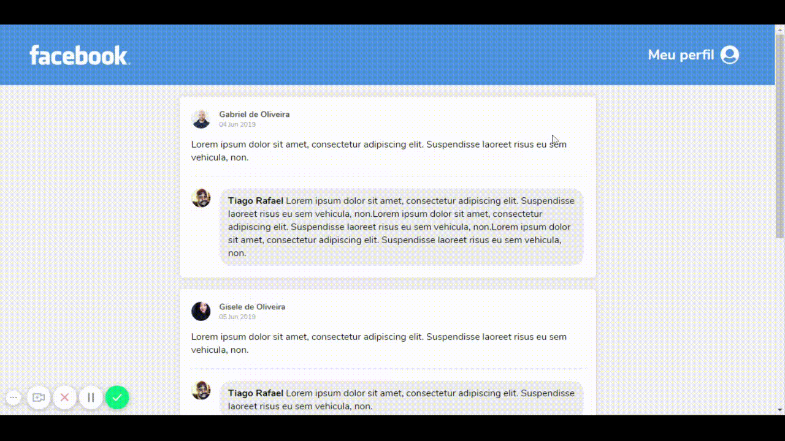

<h1 align="center">
    
</h1>

<h2 align="center">
  Desafio do 4° Módulo de React !
</h2>

  <a href="#fire-sobre-o-desafio"> Sobre o desafio </a>&nbsp;&nbsp;&nbsp;|&nbsp;&nbsp;&nbsp;
  <a href="#memo-licença"> Licença </a>

## :fire: Sobre o desafio

  

  Desenvolver uma interface semelhante com a do Facebook utilizando React.

  Para saber mais sobre o desafio :point_right: [Clique Aqui](https://github.com/Rocketseat/bootcamp-gostack-desafio-04) :point_left:

## :memo: **Licença**

Esse projeto está sob a licença MIT. Veja o arquivo [LICENSE](LICENSE.md) para mais detalhes.

---

Feito com :heart: by Mauro de Souza - Email: maurodesouza2017@hotmail.com
